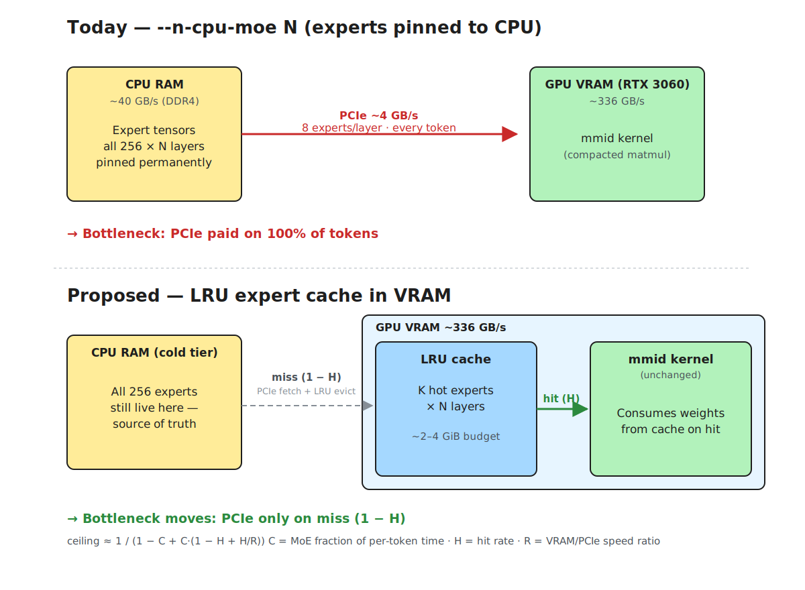

# RFC: LRU expert cache for llama.cpp MoE inference on consumer GPUs

Status: draft, stage-0 (premise-check not run)
Author: pewterzz
Target: llama.cpp `ggml-cuda` backend
Scope: Qwen3-MoE / Qwen3.6-A3B-class models (256 experts, 8 active, ~35B params)
       on consumer NVIDIA cards with 6-12 GB VRAM.



_Source: [`expert-cache-dataflow.excalidraw`](expert-cache-dataflow.excalidraw) (editable), rendered to [`expert-cache-dataflow.svg`](expert-cache-dataflow.svg) and [`expert-cache-dataflow.png`](expert-cache-dataflow.png)._

## 1. Problem

`llama-server` today offers two placements for MoE FFN expert weights:

- All on GPU (`--n-gpu-layers 999`, no override) — needs enough VRAM for the full
  expert tensor stack; doesn't fit 35B on a 6 GB card at any quant.
- All on CPU for the first N layers (`--cpu-moe` / `--n-cpu-moe N`) — expert
  tensors are pinned to the CPU buffer type via `tensor_buft_overrides`. Every
  forward pass pulls the 8 active experts' rows across PCIe. On DDR4-3200
  (~40 GB/s theoretical, ~12-15 GB/s PCIe Gen3 x4 on a laptop) this is the
  binding bottleneck.

The sweep measurements in the README (`slim-ml lc-sweep` run April 2026, RTX 3060
Laptop 6 GB) show the tradeoff cliff: landing 14 of 40 expert layers on GPU
buys +22% t/s at the cost of dropping ctx 128K→16K. The other 26 layers still
pay the PCIe tax every token.

**Hypothesis.** Per-token router selections are not uniform over the 256
experts. A small subset is hot. A **fixed-budget GPU-resident LRU cache of
expert weights** — independent of whole-layer placement — would let us keep
~2-4 GiB of "hottest K experts per layer" in VRAM and fall back to the current
PCIe path on miss. That gets GPU-speed compute on cache hits without paying
full VRAM for all 256 experts.

This is the llama.cpp analogue of the C++ "SwitchLinear-equivalent packed
`ggml_mul_mat_id` with GPU expert caching" called out in the chat.

## 2. The premise is not yet validated

**Measured routing skew so far** (from `README.md §Expert caching`):

| model | top-10% experts | captures | verdict |
|---|---|---|---|
| OLMoE-1B-7B (64 experts) | 6 experts | 26.2% of routes | **below threshold** |

Measured on a 128-token multi-topic prompt. Below the 30% threshold we set for
migration to pay off on laptop-tier models. Per-layer the picture is better
(layer 14 hits 35%), but aggregate is not.

**This is evidence against the premise on the models we've measured.** Qwen3.6-
35B-A3B has 256 experts / 8 active — a different shape, and potentially more
skewed (more experts means more tail). But we haven't measured it yet. Running
the kernel work first would be betting a week+ on an unmeasured distribution.

### Kill criteria (stated up front so future-me can't rewrite them)

Before writing CUDA, run `slim-ml/tools/routing_observe.py` against an MLX port
of Qwen3-30B-A3B or Qwen3.6-35B-A3B on a **coding-workload prompt** ≥500 tokens
(the actual workload for this build, not OLMoE's multi-topic essay which
deliberately spreads routes). Record top-5/10/20% capture aggregate and
per-layer.

Go / no-go thresholds:

| top-10% capture | decision |
|---|---|
| ≥40% | **go** — cache with K = top-10% will give ≥40% hit rate, plenty of headroom |
| 30-40% | **go, narrow** — sweep K ∈ {5%, 10%, 20%} to find the knee |
| 20-30% | **pause** — build per-layer adaptive K (hot layers only); may not be worth the complexity budget |
| <20% | **stop** — routing is too uniform, cache buys <20% hit rate; reach for a different technique |

Routing distribution is a property of the model, not the runtime. If MLX
Qwen3-MoE is Zipfian, llama.cpp Qwen3-MoE will be Zipfian. We don't need a
llama.cpp-side hook for the premise check.

## 3. Proposed design (gated on §2 passing)

### 3.1 Cache shape

Per MoE layer, a GPU-resident weight cache holding up to K expert slots. Each
slot stores one expert's up/gate/down tensors packed as the model uses them
(quantized, same layout as the on-GPU path uses when `--n-gpu-layers 999`).

```
ExpertCache {
  per_layer: Vec<LayerCache>
}

LayerCache {
  capacity: K,                    // tuned, e.g. 10% of num_experts
  slots: [GpuBuf<expert_weights>; K],
  expert_to_slot: HashMap<expert_id, slot_idx>,
  lru_order: IntrusiveList<slot_idx>,
  stats: { hits, misses, evicts }
}
```

Budget the cache globally: given a user flag `--expert-cache-vram MiB`, divide
across MoE layers (equal or proportional to activation rate from the premise
check).

### 3.2 Where the surgery happens

Two candidate intercept points, picked for minimum invasiveness:

**Option A: buffer-type override (clean).**
Replace `llm_ffn_exps_cpu_override()` (`common/arg.cpp:2292`) with a new
"cached" buffer type that wraps the CPU buffer and maintains a GPU-side
residency map. This is the "proper" path — the rest of the graph sees a
normal tensor; residency is transparent to the CUDA op.

Pro: clean, composes with existing backend dispatch; works for `mul_mat_id`
*and* any future MoE op without per-op changes.
Con: new buffer_type implementation; must interact correctly with graph
scheduling and allocator pooling.

**Option B: per-op intercept in `ggml_cuda_mul_mat_id` (hacky, prototype-first).**
At `ggml/src/ggml-cuda/ggml-cuda.cu:2328`, before dispatching, inspect the ids
tensor for the current batch, check the cache, and either:
- hit: bind GPU-resident weights and run the existing `mmid` kernel unchanged
- miss: pull weights CPU→GPU into a free slot (evicting LRU), then run

Pro: localized change; easy to prototype and benchmark; no buffer_type work.
Con: every MoE op checks the cache; duplicated if future MoE ops land; doesn't
respect the engine's tensor-allocator boundaries.

**Plan: prototype Option B first to prove the win; migrate to Option A for
upstream-acceptable shape.**

### 3.3 Relevant llama.cpp call sites to study before implementation

| file : line | relevance |
|---|---|
| `common/arg.cpp:2288-2309` | where `--cpu-moe` / `--n-cpu-moe` register buffer_type overrides — new flag `--expert-cache-vram` joins here |
| `ggml/src/ggml-cuda/ggml-cuda.cu:2328` (`ggml_cuda_mul_mat_id`) | Option B intercept |
| `ggml/src/ggml-cuda/mmid.cu` | the compacted-expert kernel itself; unchanged, we just feed it GPU-resident src0 |
| `ggml/src/ggml-cuda/ggml-cuda.cu:2341` `[TAG_MUL_MAT_ID_CUDA_GRAPHS]` | CUDA graph stream-sync notes; cache fills must not break graph capture |
| `ggml/src/ggml-cuda/ggml-cuda.cu:2949` | the other CUDA graph note — `mul_mat_id` already needs stream sync under some conditions |

### 3.4 Expected speedup (upper bound)

Let:
- `H` = cache hit rate (= measured top-K capture, from premise check)
- `C` = fraction of per-token time currently spent in CPU-resident MoE ops
  (from `llama-server --timings` or nsys profile)
- `R` = ratio of GPU-bound MoE time to PCIe-bound MoE time on this hardware
  (needs measuring; expect 5-15× on RTX 3060 laptop given VRAM ~336 GB/s vs
  PCIe 3.0 x4 ~4 GB/s usable)

Upper-bound speedup on total t/s:

```
speedup = 1 / (1 - C + C · (1 - H + H/R))
```

Rough sanity check for Qwen3.6-35B at ngl=999 --n-cpu-moe=26 (current sweep
winner, 31.6 t/s): if `C ≈ 0.6` (MoE dominates), `R = 10`, and `H = 0.4` (target
from premise check top-10%), speedup ≈ 1.28× → ~40 t/s. That's the optimistic
number and it assumes only mat-mul time, no PCIe overhead on miss evictions.

**Floor expectation:** if the premise check shows `H = 0.3` and real `R = 5`,
speedup ≈ 1.13× → ~36 t/s. Still a win but not dramatic. This sets the
"is it worth shipping" bar.

## 4. Out of scope

- Streaming prefetch of predicted-next experts (a predictor model or the
  router's top-beyond-8 hint could drive this — second-order optimization).
- Cross-layer eviction policies (e.g. "layer 39 is dead weight, steal its
  cache"). Per-layer LRU first.
- Non-CUDA backends. Metal doesn't have the VRAM/RAM bandwidth gap this
  exploits; ROCm is untested hardware for me.
- Draft model expert caching. Draft is dense on our target pair.
- Upstream PR. First prove the win in a fork.

## 5. Work plan (stage gates)

| stage | artifact | gate to next stage |
|---|---|---|
| **0** (premise check) | routing_observe on MLX Qwen3-MoE, coding prompt, 500+ tok | top-10% capture ≥30% on ≥50% of MoE layers |
| **1** (profile) | nsys/nvprof profile of `llama-server` at sweep-winner config, decomposing time into (CPU-MoE transfer, CPU-MoE compute, GPU-MoE compute, attention, other) | `C` fraction known; `R` known |
| **2** (Option B prototype) | ~500 LoC patch to `ggml_cuda_mul_mat_id` adding LRU cache behind `--expert-cache-vram` flag | measured speedup ≥1.15× on Qwen3.6-35B at matched quality |
| **3** (Option A rewrite) | buffer_type override that composes with existing allocator | same speedup, cleaner code, ready for upstream discussion |
| **4** (tuning) | per-layer adaptive K, prefetch predictions, cache warmup | secondary |

**Hard stop criterion between stages 1 and 2:** if `C < 0.3` or `R < 3`, the
ceiling speedup is <1.1× regardless of hit rate. Pick a different technique.

## 6. Why this is novel vs what's in the repo today

The repo today has `--n-cpu-moe N`, which is all-or-nothing per layer: either
the layer's experts live fully on GPU (fast, costs full VRAM) or fully on CPU
(slow, costs no VRAM). The idea here is **subset caching within a CPU-pinned
layer** — pay partial VRAM for partial speedup, where "partial" is governed by
the measured routing skew rather than user guesswork.

The DeepSeek/Mixtral-MoE literature discusses similar ideas (SE-MoE, Fiddler,
expert offloading with caches). I haven't surveyed exhaustively; the novel part
here is the llama.cpp-specific implementation and the RTX 3060-class target.
Will compare to prior art before §stage 3.

## 7. What lands in slim-ml from this RFC

Independent of llama.cpp C++ work, slim-ml gains:

- `slim-ml lc-moe-probe MODEL.gguf` — new CLI that loads the MoE model into
  llama.cpp with a lightweight router-logging build (stage-1 instrumentation)
  and reports routing distribution. Parallel to MLX's `routing_observe.py`
  but on the actual runtime the cache would target.
- RFC doc itself (this file).
- Revised `technique.py` entry for `expert_cache` with the stage-gate state
  machine exposed to `slim-ml techniques`.
